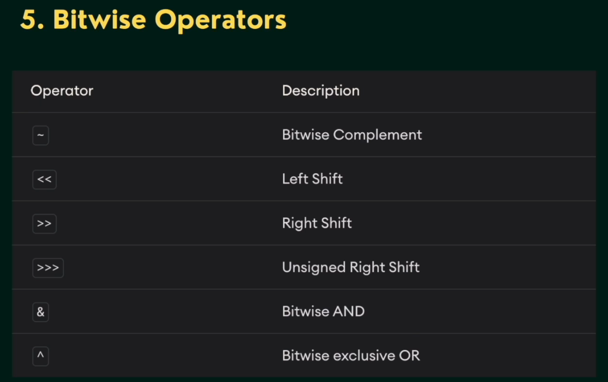

# Java Basic To Advance

## 1. Introduction

### Data Types in Java:


### Data Types Implicit Conversion:


---
## 2. Java Operators & Binary Number System + Taking User Input

Agenda:
- Binary Number System
- Operators in Java
- Taking User Input

### Binary Number System

#### Convert Decimal To Binary


#### Convert Binary To Decimal


Memorize It:
2^0 = 1  
2^1 = 2  
2^2 = 4  
2^3 = 8  
2^4 = 16  
2^5 = 32  
2^6 = 64  
2^7 = 128  
2^8 = 256  
2^9 = 512  
2^10 = 1024

#### Binary Addition


#### Binary Subtraction


### Types of Operators in Java

1. Arithmetic Operators
2. Assignment Operators
3. Relational Operators
4. Logical Operators
5. Unary Operators
6. Bitwise Operators

#### Arithmetic Operators

+ -> Addition
- -> Subtraction
* -> Multiplication
/ -> Division
% -> Modulo Operation (Remainder after division)

#### Assignment Operators


#### Relational Operators


#### Logical Operators


#### Bitwise Operators



#### Other Operators

- Increment/ Decrement Operators

a++ -> a = a + 1
a-- -> a = a - 1

- Ternary Operators

a > 1 ? true : false

### Taking User Input using Scanner

- In order to use the object of Scanner, we need to import java.util.Scanner package.
- Scanner is a predefined class in Java.

```java
import java.util.Scanner;

Scanner sc = new Scanner(System.in);
```

#### Various Input Types using Scanner

- We can use nextLong(), nextFloat(), nextDouble(), and next() methods to get long, float, double, and string input respectively from the user.

Note: It is recommended to close the scanner object once the input is taken using the close() method.

---
## 3. Conditional Statements

1. if-else statement
2. if-else if- else statement
3. Nested if-else statement
4. Working with the Logical Operators 
5. Ternary Operator
6. Switch statement

### if-else statement

```java
if (condition) {
    // code to execute if condition is true
} else {
    // code to execute if condition is false
}
```

---

### if-else statement

```java
if (condition1) {
    // code if condition1 is true
} else if (condition2) {
    // code if condition2 is true
} else {
    // code if all conditions are false
}
```

---

### Nested if-else statement

```java
if (condition1) {
    if (condition2) {
        // code if both conditions are true
    } else {
        // code if condition1 is true but condition2 is false
    }
} else {
    // code if condition1 is false
}
```

---

### Working with Logical Operators

```java
if (a > b && b > c) {
    // AND operator
}

if (x == 10 || y == 20) {
    // OR operator
}

if (!(x > y)) {
    // NOT operator
}
```

---

### Ternary Operator

```java
variable = (condition) ? expression1 : expression2;
```

---

### Switch statement

```java
switch (expression) {
    case value1:
        // code block
        break;
    case value2:
        // code block
        break;
    default:
        // default code block
}
```

---
## 4. Loops

1. for loop
2. while loop
3. do-while loop
4. break & continue statements
5. Nested loops
6. Labeled break & continue statements

### for loop

```java
for (initialization; condition; update) {
    // code to be executed
}
```

---

### while loop

```java
while (condition) {
    // code to be executed
}
```

---

### do-while loop

```java
do {
    // code to be executed
} while (condition);
```

---

### break & continue statements

```java
for (int i = 0; i < 10; i++) {
    if (i == 5) {
        break; // exits the loop
    }
    if (i % 2 == 0) {
        continue; // skips to the next iteration
    }
}
```

---

### Nested loops

```java
for (int i = 0; i < 3; i++) {
    for (int j = 0; j < 3; j++) {
        // code to be executed
    }
}
```

---

### Labeled break & continue statements

```java
outerLoop:
for (int i = 0; i < 3; i++) {
    for (int j = 0; j < 3; j++) {
        if (j == 1) {
            break outerLoop; // exits the outer loop
        }
    }
}

outerLoop:
for (int i = 0; i < 3; i++) {
    for (int j = 0; j < 3; j++) {
        if (j == 1) {
            continue outerLoop; // skips to the next iteration of outer loop
        }
    }
}
```

## 5. Arrays (Important)

1. How do the Arrays work?
2. Creating and Declaring Arrays
3. for-each loop
4. Multi-dimensional Arrays

### How do the Arrays work?

- Arrays are stored in contiguous memory (consecutive memory locations).
- Array indexing is zero-based, which means the first element of an array is accessed using index 0, and the last element is accessed using index (length - 1).
- Default Values in Java Arrays
  - Numeric arrays (byte, short, int, long, float, double):
    - After declaring the size of a numeric array, the default value stored in each element is 0 (or 0.0 for floating-point types).
  - Character arrays (char):
    - After declaring the size of a char array, the default value stored in each element is '\u0000', which represents the null character (appears as blank).
  - Boolean arrays (boolean):
    - After declaring the size of a boolean array, the default value stored in each element is false.
  - Reference type arrays (String, Object, etc.):
    - After declaring the size of an array of objects or strings, the default value stored in each element is null.

```java
int intArray[]; (recommended)
or int[] intArray;

intArray = new int[20]; // Allocating memory to array
```

### Multi-dimensional Array


## 6. Methods/ Function

1. How do the methods/ functions work?
2. Declaring a Java Method
3. Calling a Method
4. Method return type
5. Method Parameters
6. Math Library Methods

### How do the methods/ functions work?

- A method is a block of code or collection of statements or a set of code grouped together to perform a certain task or operation. It is used to achieve the reusability of code.

### Components of a Method


### Method Parameters

- A method parameter is a value accepted by the method. As mentioned earlier, a method can also have any number of parameters.

```java
average(int a, int b) {

}
```
### Math Class Methods

1. Math.min(x,y)
2. Math.max(x,y)
3. Math.sqrt(x)
4. Math.pow(x,y)
5. Math.abs(x)
6. Math.random()
7. Math.floor(x)
8. Math.ceil(x)
9. Math.round(x)

## 7. String

1. Basics of String
2. How to create String
3. Immutability in Strings
4. Comparing two Strings
5. String Methods

### Basics of String

- In Java, String is basically an object that represents a sequence of char values. An array of characters work same as Java String.

### How to create String and stored


- By string literal

```java
String name = "Ram";
```

- By new keyword

```java
String name = new String("Ram");
```

### Immutability in Strings


### Comparing two Strings


- (==) References are stored in the Stack Memory.
- For Primitive data types "Values" are checked.
- For Non-Primitive data types "Reference" are checked.


### String Methods


- Strings are immutable.
- Almost all string operations do not modify the original string. Instead, they return a new String object with the modified value.

```java
String s1 = "Java";
String s2 = s1.toUpperCase();

System.out.println(s1); // Java
System.out.println(s2); // JAVA
```