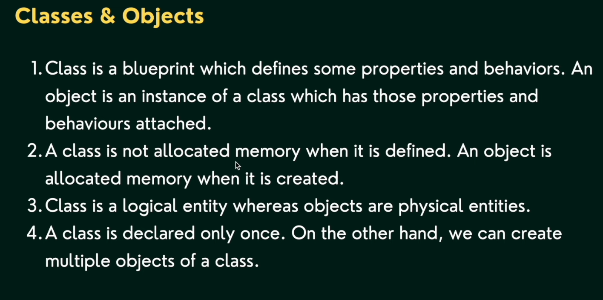
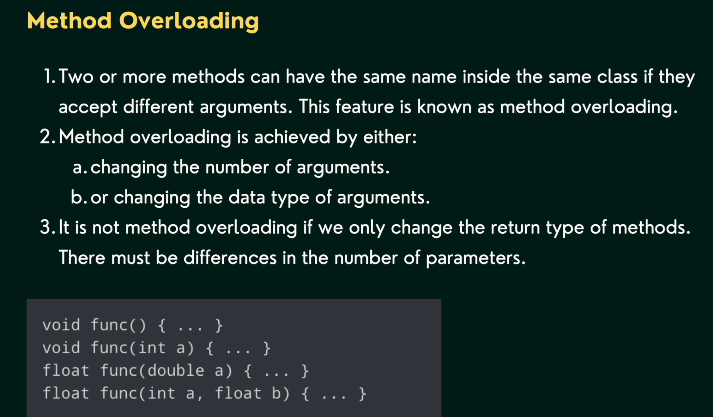
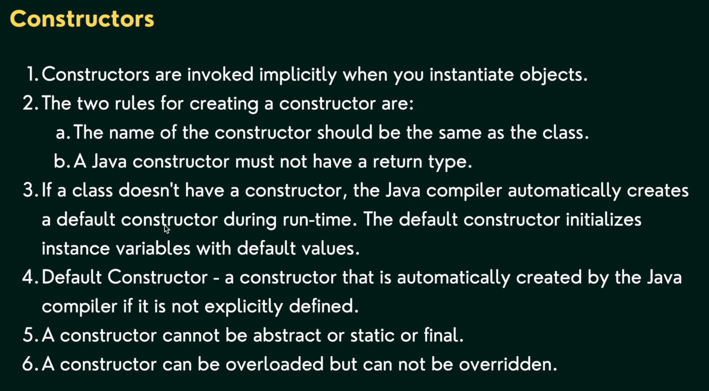

# OOPS

## Classes and Objects (oops1)

1. Classes & Objects
2. Constructors
3. Method + Constructor Overloading
4. this keyword in Java

### Classes & Objects

Example of Class:
- Class is a Factory
- Product from factory is an Object

- Class is a non-primitive data type

#### Memory Allocation

- Class is stored in Meta space.
- Objects are stored in Heap memory
- Class first letter must be Capital

#### Method Overloading

- In method overloading, we can create multiple methods with the same name but different parameters.

#### Constructors

#### this keyword

- In Java, "this" keyword is used to refer to the current object inside a method or a constructor. 
- We mostly use this keyword to remove any Ambiguity in Variable Names. We can also use this to invoke methods of the current class or to invoke a constructor of the current class.
- this stores current objects reference.
