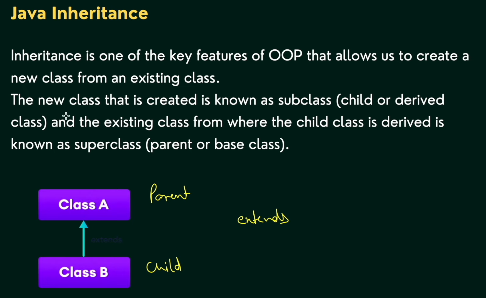
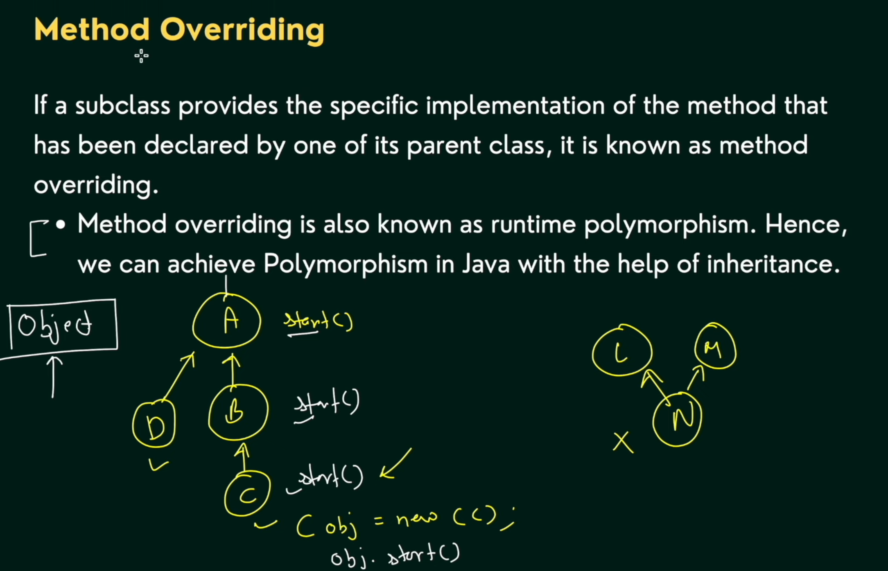
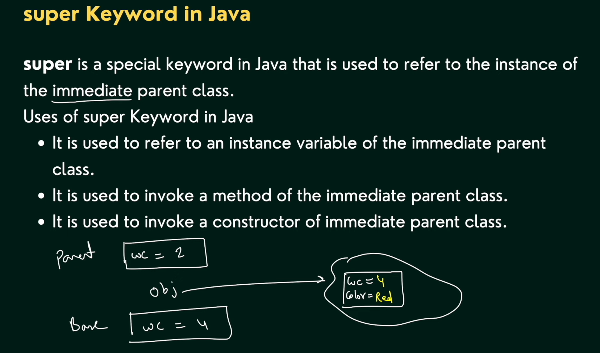
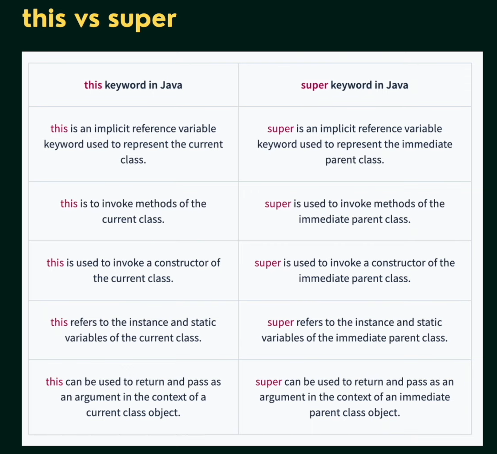
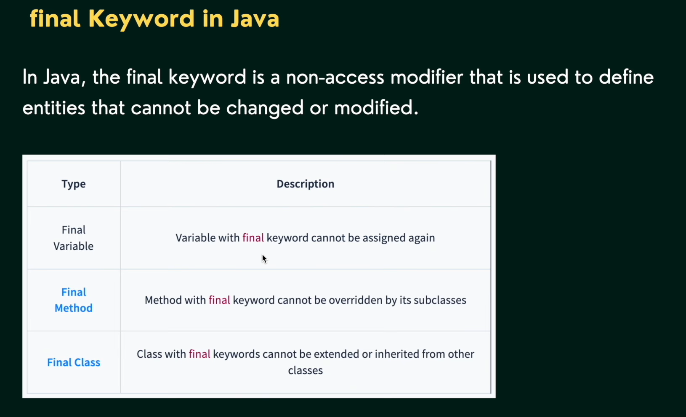

# OOPS 2

## Java Inheritance (oops2)

1. Inheritance
2. Method overriding
3. super keyword
4. this vs super keyword
5. final keyword

### Inheritance

### Method overriding

### This and Super keyword

- The this keyword in Java is a reference variable that refers to the current object instance within a method or constructor. 

### this vs super

### final keyword

